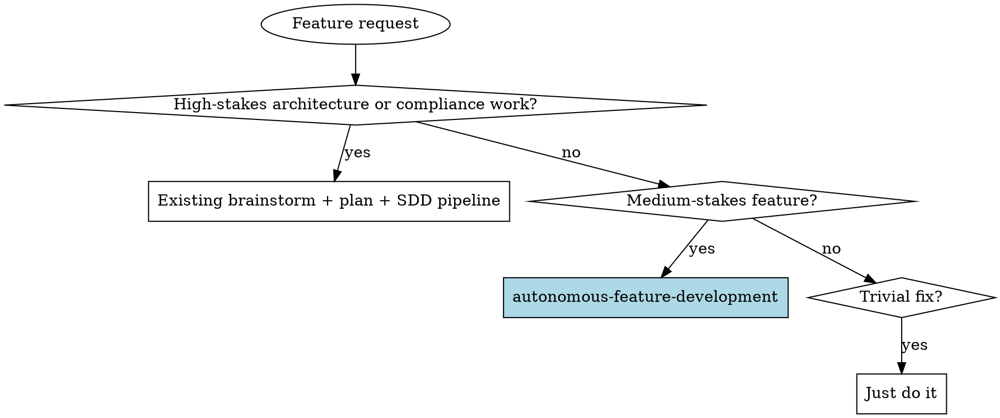
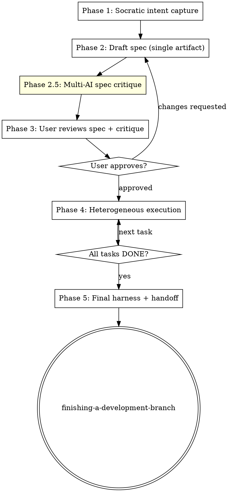

# Autonomous Feature Development

Take a feature from idea to shipped through a single skill. Socratic questions surface intent. A single spec captures scope, file map, **validation harness** (executable proof the work succeeded), and **escalation triggers** (concrete conditions that force a human in the loop). Multi-AI spec critique runs once before user approval. Then heterogeneous executors — Claude subagents, Codex, Gemini — each take tasks suited to their skillset. The driving agent only bothers the user when a declared trigger fires.

**Core principles:**
- One spec, no separate plan. The spec contains everything execution needs.
- Validation is built in. Every task has a runnable harness step that proves it works.
- Escalation is explicit. Triggers are listed concretely; agents stop on those triggers, push through everything else.
- Reviews are placed where they pay back. One mandatory multi-AI critique on the spec (highest leverage). No per-task review ceremony.
- Executors are heterogeneous. Claude / Codex / Gemini are picked per task based on what each does best.

## When to Use



**Use this skill when:**
- Feature is a normal-sized unit of work — a few files, hours not days
- A clear functional check exists or can be defined (test command, curl recipe, click sequence, screenshot)
- You'd rather give the agent autonomy with declared escalation triggers than babysit each step

**Don't use this skill when:**
- The request is a one-line fix or a typo — overhead exceeds value
- The work is deeply architectural, security-critical, or compliance-driven — use the existing pipeline so the design challenge round and full review loops apply
- You don't have at least a rough idea what success looks like — start with `brainstorming` to discover that first, then come here

## The Five Phases



### Phase 1 — Socratic intent capture

Ask focused questions, **one at a time**, in plain conversation. Pattern from `brainstorming/SKILL.md`. Aim for 3-5 questions total. Two of these are mandatory and unique to this skill:

**Mandatory question — validation harness:**

> "How will we prove this works end-to-end? Concrete options: a test command, a curl recipe, a manual click sequence, a screenshot diff. Pick one or describe your own."

The answer seeds the spec's harness section. If user can't articulate one, that's a signal the work needs deeper brainstorming first — surface this and offer to detour into the brainstorming skill.

**Mandatory question — escalation triggers:**

> "When should the agent stop and ask you instead of pushing through? Examples: more than 2 failed attempts, anything touching auth or migrations, scope expanding beyond original ask, hitting a token/time budget."

Capture concretely. Vague triggers ("when something feels off") don't enforce — push for measurable conditions.

**Other questions:**
- Scope boundary: what's in, what's explicitly NOT in
- Success criteria beyond "harness passes"
- Constraints (existing patterns to follow, files to avoid, dependencies to respect)
- Reusable code: any existing functions/utilities you already know cover part of this

Skip questions whose answers are obvious from context. Don't burn turns confirming what the user already said.

### Phase 2 — Draft spec (single artifact)

Write one document at `docs/superpowers/specs/YYYY-MM-DD-<topic>-spec.md`. No separate plan file. No tickets unless user asks. Use `templates/spec-template.md` as the skeleton.

Required sections (all seven, in this order):

1. **Context** — why this work, what problem it solves, intended outcome
2. **Scope** — explicit *in* / *out* / *non-goals* lists
3. **File map** — files to create or modify, with one-line responsibility each. Reference reusable functions/utilities by file:line where they exist.
4. **Validation harness** — runnable commands or scripted sequences. Marked *"executor may extend per-task"* — when a task adds new validatable surface, its executor adds the new step here.
5. **Escalation triggers** — concrete, enforceable list across four kinds:
   - **Functional** — e.g. "2 consecutive harness failures on the same task", "test exits non-zero after fix attempt"
   - **Semantic** — e.g. "spec is ambiguous on this task", "scope creep detected", "discovery of behavior not described in spec"
   - **Resource** — e.g. "subagent exceeded N tokens or M wall-clock minutes", "context window approaching limit"
   - **Domain** — categorical hard stops (always confirm regardless of autonomy): "data loss risk", "production write", "schema migration", "credential / secret handling", "deletion of files outside scope"
6. **Autonomy** — populated in Phase 3 after user negotiation. Format: global default + per-task overrides where they apply.
7. **Tasks** — ordered list. Each task has: intent, files touched, harness step that proves it (subset of section 4), task-specific escalation notes if any, and a `provider:` field (`claude` | `codex` | `gemini`).

### Phase 2.5 — Multi-AI spec critique (mandatory, default on)

This is the **one** mandatory multi-AI checkpoint. The spec is the highest-leverage artifact — getting it right pays back every downstream task.

Run before showing the spec to the user:

```bash
"$CONSULT_SCRIPT" both "$(cat <<EOF
Critique this feature spec at <ABSOLUTE_PATH_TO_SPEC>.

Focus on:
1. Ambiguity — are any sections open to interpretation?
2. Validation harness — does it actually prove what the spec promises? Coverage gaps?
3. Escalation triggers — concrete enough to enforce, or too vague?
4. Scope creep risk — anywhere a task could quietly expand?
5. Missing edge cases or failure modes the spec doesn't address.

Be specific — reference section names and task numbers. Keep it under 400 words.
EOF
)"
```

Synthesize Codex and Gemini findings. Apply obvious fixes silently. Surface the rest to the user in Phase 3 with provider attribution so they can decide whether to incorporate.

If `consult.sh check` shows neither provider available, **skip this phase** with a one-line note to the user. Do not block on it.

### Phase 3 — User reviews spec + critique

Present:
- Path to the spec file
- The synthesized critique from Phase 2.5 (with provider attribution where relevant)
- Open questions remaining

Then negotiate **autonomy**:

> "Three autonomy levels for execution:
>
> 1. **strict** — confirm with you before each task starts
> 2. **senior-dev** (default) — run autonomously; only stop on declared triggers or domain stops
> 3. **yolo** — only stop on domain stops (data loss / prod / schema / credentials)
>
> Pick a global default. You can also pin specific tasks to a different level — e.g. 'strict on the migration task, senior-dev on everything else'."

Write the answer into the spec's **Autonomy** section.

Negotiate **task-to-provider routing** if any tasks have non-default providers in section 7. Surface the auto-picked routing and let the user override.

If user requests changes, edit the spec and re-run Phase 2.5 (single round only — don't loop critique-fix-critique indefinitely; if a third pass would be needed, escalate to user).

User approval → Phase 4.

### Phase 4 — Heterogeneous execution

Dispatch one task at a time, in spec order. TodoWrite tracks them.

#### Task-to-provider routing

Pick per task based on character. The spec author proposed defaults; user adjusted in Phase 3.

| Task character | Default provider | Why |
|----------------|------------------|-----|
| Mechanical edit, refactor, test scaffolding, strict spec adherence | **codex** | Strong on implementation patterns, follows specs precisely |
| Touches >10 files or needs broad-context reads | **gemini** | Largest context window |
| Design judgment, ambiguous spec, multi-file orchestration, novel logic | **claude** subagent | Best at nuance; handles ambiguity |
| Default when unsure | **claude** subagent | Safest fallback |

The spec's per-task `provider:` field locks in the choice. Driving agent does not re-decide.

#### Dispatch

For Claude subagent: use the Agent tool with subagent_type `general-purpose` (or a more specific one if appropriate).

For Codex or Gemini: use `scripts/dispatch.sh` (this skill's wrapper around `consult.sh` for execution mode):

```bash
"$DISPATCH_SCRIPT" <codex|gemini> "$(cat <<EOF
TASK: <task intent>
FILES: <files touched>
SPEC: <absolute path to spec file>
HARNESS: <command that proves this task done>
TRIGGERS: <concrete escalation triggers, both global and task-specific>
AUTONOMY: <strict | senior-dev | yolo>

Implement the task. Edit files in place. When done (or stuck), end your response with EXACTLY ONE of:

  STATUS: DONE — <one-line summary>
  STATUS: DONE_WITH_CONCERNS — <concerns, one line>
  STATUS: NEEDS_INPUT — <question for human>
  STATUS: BLOCKED — <what's blocking>
  STATUS: ESCALATE — <which trigger fired>

Run the harness command yourself before claiming DONE. If the harness reveals new validatable surface, add a step describing how to validate it to the spec's "Validation harness" section.
EOF
)"
```

#### Status protocol

Adopted from `subagent-driven-development/SKILL.md:111-126`. Every executor must end with one of:

| Status | Driving agent action |
|--------|----------------------|
| `DONE` | Mark task complete, advance |
| `DONE_WITH_CONCERNS` | Log concern in spec under task; advance unless `strict` (then confirm with user first) |
| `NEEDS_INPUT` | Surface question to user, re-dispatch with answer |
| `BLOCKED` | Diagnose: context problem (re-dispatch with more), reasoning problem (escalate model or split task), or escalate to user |
| `ESCALATE` | A trigger fired — surface to user, await direction |

#### Trust-but-verify after non-Claude tasks

Codex and Gemini exit semantics are looser than Claude subagents (Codex sometimes claims done while admitting it couldn't read files — see `CLAUDE.md` Codex gotchas §4). After any Codex or Gemini task:

1. Driving agent reads the diff (`git diff` since task start SHA)
2. Re-runs the task's harness step
3. Only then marks the task complete

For Claude subagents, the harness pass during execution suffices — the driving agent can spot-check at its discretion but is not required to re-run.

#### Stuck-helper (on-demand consult)

When a functional or semantic trigger fires *during* a task, the executor may opportunistically invoke a consult before escalating to user — saves a user round-trip if the problem is solvable:

```bash
"$CONSULT_SCRIPT" both "$(cat <<EOF
I'm stuck on this task: <task intent>

Files involved: <paths>
Spec: <path>

What I've tried: <briefly>
The blocker: <what's failing>

Fresh eyes — what am I missing?
EOF
)"
```

Route to the providers *not* currently executing the task (i.e. if Codex is running the task, ask Gemini and Claude). On-demand only — never a mandatory checkpoint.

#### Notification policy

Driving agent surfaces to user only when:
- `NEEDS_INPUT`, `BLOCKED`, or `ESCALATE`
- Any **domain** trigger fires (always, regardless of autonomy)
- Task autonomy is `strict` (before each task) or per-task strict override applies

`senior-dev` and `yolo` proceed silently on `DONE` and `DONE_WITH_CONCERNS`. Concerns are accumulated in the spec for end-of-feature review.

### Phase 5 — Final harness + handoff

1. **Run the full harness end-to-end.** Non-negotiable — `verification-before-completion/SKILL.md` discipline. If anything fails, treat it as a Phase 4 trigger (not a Phase 5 wrap).
2. **Surface accumulated `DONE_WITH_CONCERNS` notes** for human review. User decides whether to address now or defer.
3. **Hand off to `finishing-a-development-branch`** for merge/PR decision. That skill already offers optional external AI review of the branch diff.

## Multi-AI consultation map

| Where | What runs | Mandatory? |
|-------|-----------|-----------|
| Phase 2.5 — spec critique | Codex + Gemini critique the spec | **Yes** (default on, skips if neither available) |
| Phase 3 — task routing | User can pin tasks to Codex / Gemini for skillset fit | Optional |
| Phase 4 — task execution | Codex or Gemini may execute selected tasks | Optional, per spec |
| Phase 4 — stuck-helper | Executor consults the providers it isn't using | On-demand |
| Phase 5 — branch review | Inherited from `finishing-a-development-branch` | Optional |

Phase 2.5 is the one mandatory checkpoint — single round, highest leverage.

## Status protocol contract

Every executor (Claude subagent, Codex, Gemini) ends with one of these on its own line:

```
STATUS: DONE — <reason>
STATUS: DONE_WITH_CONCERNS — <concerns>
STATUS: NEEDS_INPUT — <question>
STATUS: BLOCKED — <blocker>
STATUS: ESCALATE — <trigger>
```

This is enforced via the dispatch prompt. Executors that don't comply are re-dispatched with a clarification.

## Red Flags

**Never:**
- Skip Phase 2.5 just because the spec "looks fine" — the cheap critique catches expensive bugs
- Let the harness be aspirational ("we'll figure out testing later") — must be runnable when the spec is approved
- Push through a domain trigger without confirmation, regardless of autonomy level
- Accept a Codex/Gemini task as `DONE` without driving-agent re-verification of the harness
- Loop critique-fix-critique more than once at Phase 2.5 — escalate to user instead
- Mix this skill with `writing-plans` mid-flight — they're parallel paths, not stages

**If a trigger fires:**
- `senior-dev` and `yolo`: stop, notify user, await direction. Do not "try once more"
- The stuck-helper consult is opportunistic *before* escalation, not a way to silence escalation

**If an executor doesn't end with a STATUS line:**
- Re-dispatch with: "Your previous response did not end with a STATUS line. Re-emit just the STATUS line for the work you completed."
- Do not infer status from prose

**If autonomy is `yolo` and you find yourself wanting to ask the user something:**
- Either it's a domain trigger (notify) or it's not (push through). If you can't tell, treat it as semantic trigger and notify.

## Integration

**Required:**
- `superpowers:using-git-worktrees` — set up isolated workspace before invoking this skill
- `superpowers:finishing-a-development-branch` — Phase 5 hands off to this
- `superpowers:verification-before-completion` — Phase 5 final harness pass discipline

**Reused:**
- `superpowers:consulting-other-ais` (`scripts/consult.sh`) — Phase 2.5 critique and Phase 4 stuck-helper
- Status protocol vocabulary from `superpowers:subagent-driven-development`
- Question cadence pattern from `superpowers:brainstorming`

**Subagents should use:**
- `superpowers:test-driven-development` — Claude subagent executors apply TDD when writing tests is part of the task

**Alternative paths (use instead of this skill when):**
- `superpowers:brainstorming` → `superpowers:writing-plans` → `superpowers:subagent-driven-development` — high-stakes work where multiple review rounds earn their cost
- `superpowers:executing-plans` — when execution happens in a different session

## Templates

- `templates/spec-template.md` — fill-in skeleton for the seven required sections
- `scripts/dispatch.sh` — wrapper around `consult.sh` for execution-mode dispatch to Codex / Gemini

## Example walkthrough

```
You: I'm using autonomous-feature-development for this.

[Phase 1] Three questions, one at a time:
  Q1: What's in scope? "Add --list-skills flag to consult.sh"
  Q2: Out of scope? "Don't change argument parsing for other flags"
  Q3 (mandatory — harness): How do we prove this works?
       "Run consult.sh --list-skills, expect skill names on stdout, exit 0"
  Q4 (mandatory — triggers):
       "Stop if the change touches more than consult.sh, or if --list-skills
        conflicts with existing arg parsing"

[Phase 2] Spec written to docs/superpowers/specs/2026-04-30-list-skills-flag-spec.md
  - Context, Scope, File map (just consult.sh), Harness (the command),
    Triggers (the two), Tasks (one task: add the flag, route claude)

[Phase 2.5] Codex + Gemini critique:
  Codex: "Harness should also verify exit code, not just stdout"
  Gemini: "Trigger 'touches more than consult.sh' — what about test files?"

  Apply: clarify trigger to "edits more than consult.sh and its tests".
  Update harness to check exit 0 explicitly.

[Phase 3] Show user spec + remaining critique. Negotiate autonomy:
  User: "senior-dev"

[Phase 4] One task, claude provider, dispatched as Claude subagent.
  Subagent: implements, runs harness, returns STATUS: DONE.

[Phase 5] Driving agent re-runs harness end-to-end. ✅
  No DONE_WITH_CONCERNS to surface.
  Hand off to finishing-a-development-branch.
```
