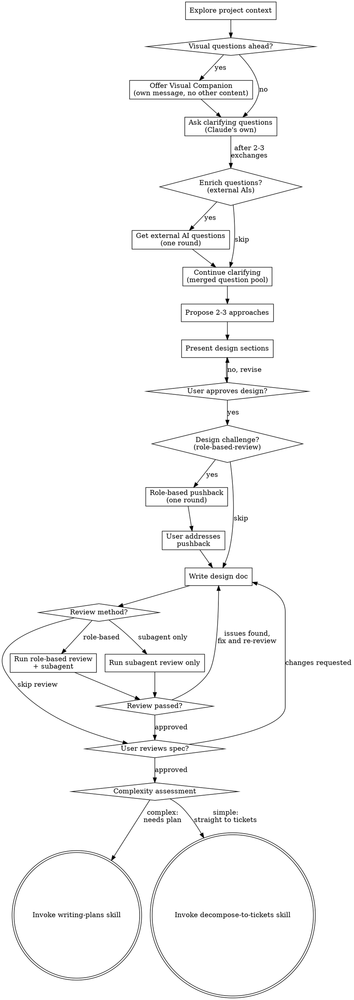

# Brainstorming Ideas Into Designs

Help turn ideas into fully formed designs and specs through natural collaborative dialogue.

Start by understanding the current project context, then ask questions one at a time to refine the idea. Once you understand what you're building, present the design and get user approval.

<HARD-GATE>
Do NOT invoke any implementation skill, write any code, scaffold any project, or take any implementation action until you have presented a design and the user has approved it. This applies to EVERY project regardless of perceived simplicity. The only valid terminal transitions from brainstorming are `writing-plans` (complex designs needing an implementation plan) and `decompose-to-tickets` (simpler designs that can go straight to tickets). Neither is an implementation skill — both are planning/decomposition skills.
</HARD-GATE>

## Anti-Pattern: "This Is Too Simple To Need A Design"

Every project goes through this process. A todo list, a single-function utility, a config change — all of them. "Simple" projects are where unexamined assumptions cause the most wasted work. The design can be short (a few sentences for truly simple projects), but you MUST present it and get approval.

## Checklist

You MUST create a task for each of these items and complete them in order:

1. **Explore project context** — check files, docs, recent commits
2. **Offer visual companion** (if topic will involve visual questions) — this is its own message, not combined with a clarifying question. See the Visual Companion section below.
3. **Ask clarifying questions** — one at a time, understand purpose/constraints/success criteria. After 2-3 exchanges when you have enough context to describe the problem, offer to enrich the question pool with external AI perspectives (see "Multi-Perspective Questions" below).
4. **Propose 2-3 approaches** — with trade-offs and your recommendation
5. **Present design** — in sections scaled to their complexity, get user approval after each section
6. **Role-based design challenge (one round)** — after user approves the design, offer to run a role-based-review for pushback before writing it up. One round only. See "Design Challenge Round" below.
7. **Write design doc** — save to `docs/superpowers/specs/YYYY-MM-DD-<topic>-design.md` and commit
8. **Spec review loop** — offer role-based review or subagent-only review of the written spec. See "Spec Review Loop" section below.
9. **User reviews written spec** — ask user to review the spec file before proceeding
10. **Complexity assessment** — evaluate whether a plan is needed before implementation. See "Complexity Assessment" below.
11. **Transition to implementation** — invoke `writing-plans` (complex) or `decompose-to-tickets` (simple)

## Process Flow



**The terminal states are `writing-plans` or `decompose-to-tickets`.** Do NOT invoke frontend-design, mcp-builder, or any other implementation skill. The ONLY skills you invoke after brainstorming are `writing-plans` (when complexity warrants a plan) or `decompose-to-tickets` (when going straight to tickets).

## The Process

**Understanding the idea:**

- Check out the current project state first (files, docs, recent commits)
- Before asking detailed questions, assess scope: if the request describes multiple independent subsystems (e.g., "build a platform with chat, file storage, billing, and analytics"), flag this immediately. Don't spend questions refining details of a project that needs to be decomposed first.
- If the project is too large for a single spec, help the user decompose into sub-projects: what are the independent pieces, how do they relate, what order should they be built? Then brainstorm the first sub-project through the normal design flow. Each sub-project gets its own spec → plan → implementation cycle.
- For appropriately-scoped projects, ask questions one at a time to refine the idea
- Prefer multiple choice questions when possible, but open-ended is fine too
- Only one question per message - if a topic needs more exploration, break it into multiple questions
- Focus on understanding: purpose, constraints, success criteria

**Multi-Perspective Questions (optional, after 2-3 exchanges):**

Once you have enough context to describe the problem (typically after 2-3 clarifying questions), offer to get external AI perspectives on what else to ask:

> "I have a good sense of the basics. Want me to get Codex and Gemini's take on what else we should nail down before designing? They sometimes catch angles I miss."
>
> [Yes / No, I think we're good]

If yes, send a brief summary to external AIs via consulting-other-ais:

```
We're designing [brief description]. Here's what we know so far:
- [Key decisions/answers from conversation so far]
- [Constraints identified]

What clarifying questions would you ask before designing this?
Focus on questions that cover different ground from what's already answered.
```

When results come back, deduplicate against your own remaining questions and merge into your question pool. Present them one at a time as usual, attributing where each came from:

> Here are a few more questions — some from my own analysis, some raised by Codex and Gemini:
>
> [Codex] Have you considered whether this needs to work offline?

Continue asking one at a time through the merged pool. Don't ask questions that overlap with what's already been answered.

**Exploring approaches:**

- Propose 2-3 different approaches with trade-offs
- Present options conversationally with your recommendation and reasoning
- Lead with your recommended option and explain why

**Presenting the design:**

- Once you believe you understand what you're building, present the design
- Scale each section to its complexity: a few sentences if straightforward, up to 200-300 words if nuanced
- Ask after each section whether it looks right so far
- Cover: architecture, components, data flow, error handling, testing
- Be ready to go back and clarify if something doesn't make sense

**Design for isolation and clarity:**

- Break the system into smaller units that each have one clear purpose, communicate through well-defined interfaces, and can be understood and tested independently
- For each unit, you should be able to answer: what does it do, how do you use it, and what does it depend on?
- Can someone understand what a unit does without reading its internals? Can you change the internals without breaking consumers? If not, the boundaries need work.
- Smaller, well-bounded units are also easier for you to work with - you reason better about code you can hold in context at once, and your edits are more reliable when files are focused. When a file grows large, that's often a signal that it's doing too much.

**Working in existing codebases:**

- Explore the current structure before proposing changes. Follow existing patterns.
- Where existing code has problems that affect the work (e.g., a file that's grown too large, unclear boundaries, tangled responsibilities), include targeted improvements as part of the design - the way a good developer improves code they're working in.
- Don't propose unrelated refactoring. Stay focused on what serves the current goal.

## Design Challenge Round (optional, one round)

After the user approves the design but before writing it up, offer one round of role-based pushback:

> "Design looks good to me too. Before I write it up, want me to run a role-based review for a challenge round? Multiple AI perspectives will push back on assumptions, flag risks, and suggest alternatives we might have missed. One round — then we decide what to adjust."
>
> [Yes / No, write it up]

If yes, select roles based on the type of work being designed:

| Work Type | Suggested Roles |
|-----------|----------------|
| New user-facing feature | product, architecture, QA, UX |
| API/backend work | product, architecture, QA |
| Pure refactor/infrastructure | architecture, QA |
| Bug fix | QA (+ architecture if systemic) |

Present the suggestion to the user:

> "Given this is [work type], I'd suggest reviewing through **[roles]** lenses. Want to add or skip any?"

After the user confirms roles, invoke `role-based-review` with the approved design summary as the artifact and the confirmed roles. Present the synthesized findings with role attribution (role-based-review handles the synthesis format).

The user decides which feedback items (if any) to incorporate. Then proceed to writing the design doc. **This is one round only** — do not re-invoke role-based-review after adjustments.

## After the Design

**Documentation:**

- Write the validated design (spec) to `docs/superpowers/specs/YYYY-MM-DD-<topic>-design.md`
  - (User preferences for spec location override this default)
- Use elements-of-style:writing-clearly-and-concisely skill if available
- Commit the design document to git

**Spec Review Loop:**
After writing the spec document, offer a review:

> "Spec written. How would you like it reviewed?"
>
> 1. **Role-based review** — dispatch spec-document-reviewer subagent alongside `role-based-review` with QA + architecture lenses (recommended for non-trivial designs)
> 2. **Subagent only** — standard spec-document-reviewer
> 3. **Skip review** — go straight to user review

**If role-based review:** Run the spec-document-reviewer subagent and `role-based-review` (with QA and architecture roles) in parallel. The subagent uses the spec-document-reviewer-prompt.md template. Synthesize all findings into a single list of issues, noting which reviewer raised each one.

**If subagent only:** Dispatch spec-document-reviewer subagent as usual (see spec-document-reviewer-prompt.md).

**For both paths:**
1. If Issues Found: fix, re-review (re-run whichever reviewers were used), repeat until approved
2. If loop exceeds 3 iterations, surface to human for guidance

**User Review Gate:**
After the spec review loop passes, ask the user to review the written spec before proceeding:

> "Spec written and committed to `<path>`. Please review it and let me know if you want to make any changes before we start writing out the implementation plan."

Wait for the user's response. If they request changes, make them and re-run the spec review loop. Only proceed once the user approves.

**Complexity Assessment:**

After the user approves the spec, assess whether a plan is needed before transitioning. Evaluate:

- Cross-file architectural decisions that need locking down?
- Unclear interfaces between components?
- Deep dependency chains?
- Migration or data-model risk?
- Unresolved implementation decisions?

Present the assessment:

> "This involves [reason]. I'd recommend [writing a plan first / going straight to tickets]. What do you think?"

The user decides the path. If they disagree with your recommendation, go with their preference.

**Transition to Implementation:**

- If plan needed → invoke `writing-plans` to create a detailed implementation plan
- If no plan needed → invoke `decompose-to-tickets` directly with the spec file path

These are the only two valid terminal transitions from brainstorming.

## Key Principles

- **One question at a time** - Don't overwhelm with multiple questions
- **Multiple choice preferred** - Easier to answer than open-ended when possible
- **YAGNI ruthlessly** - Remove unnecessary features from all designs
- **Explore alternatives** - Always propose 2-3 approaches before settling
- **Incremental validation** - Present design, get approval before moving on
- **Be flexible** - Go back and clarify when something doesn't make sense

## Visual Companion

A browser-based companion for showing mockups, diagrams, and visual options during brainstorming. Available as a tool — not a mode. Accepting the companion means it's available for questions that benefit from visual treatment; it does NOT mean every question goes through the browser.

**Offering the companion:** When you anticipate that upcoming questions will involve visual content (mockups, layouts, diagrams), offer it once for consent:
> "Some of what we're working on might be easier to explain if I can show it to you in a web browser. I can put together mockups, diagrams, comparisons, and other visuals as we go. This feature is still new and can be token-intensive. Want to try it? (Requires opening a local URL)"

**This offer MUST be its own message.** Do not combine it with clarifying questions, context summaries, or any other content. The message should contain ONLY the offer above and nothing else. Wait for the user's response before continuing. If they decline, proceed with text-only brainstorming.

**Per-question decision:** Even after the user accepts, decide FOR EACH QUESTION whether to use the browser or the terminal. The test: **would the user understand this better by seeing it than reading it?**

- **Use the browser** for content that IS visual — mockups, wireframes, layout comparisons, architecture diagrams, side-by-side visual designs
- **Use the terminal** for content that is text — requirements questions, conceptual choices, tradeoff lists, A/B/C/D text options, scope decisions

A question about a UI topic is not automatically a visual question. "What does personality mean in this context?" is a conceptual question — use the terminal. "Which wizard layout works better?" is a visual question — use the browser.

If they agree to the companion, read the detailed guide before proceeding:
`skills/brainstorming/visual-companion.md`
