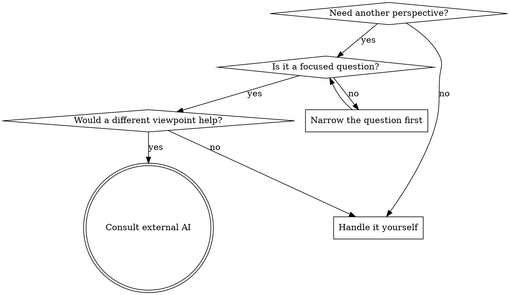

# Consulting Other AIs

Get focused perspectives from external AI providers (Codex CLI, Gemini CLI) during brainstorming, planning, or debugging. Unlike heavy orchestration, this is a lightweight consultation — you craft a focused question, point them at relevant files, and let them explore the codebase directly in read-only mode.

## Core Principle

**You control what gets sent.** Never dump the whole context. Craft a focused prompt with:
- The question or problem (1-3 paragraphs)
- File paths to examine (not file contents — they read files themselves)
- What perspective you want (critique, alternatives, risks, validation)

## When to Use



**Good times to consult:**
- During brainstorming step 4 (proposing approaches) — "what approaches are we missing?"
- After writing a design spec — "what holes do you see in this design?"
- During plan review — "is there a simpler way to structure this?"
- When stuck on a tradeoff — "given these constraints, which would you choose?"
- Debugging — "fresh eyes on this problem"

**Don't consult when:**
- The question is too broad ("review everything")
- You haven't formed your own opinion yet (consult after thinking, not instead of thinking)
- The task is simple and well-understood
- You'd need to send the entire session history for context

## How It Works

External AI CLIs (Codex, Gemini) run locally and have the same filesystem access as Claude. They can read files, search code, and explore the project — you don't need to paste file contents into the prompt.

**Codex CLI** sandbox mode is auto-detected by `consult.sh`:
```
codex exec --model <model> --sandbox <auto-detected>
```

The script probes whether `read-only` sandbox can actually read files (some Linux kernels block the bubblewrap namespace it requires). If the probe fails, it automatically falls back to `danger-full-access`. The probe result is cached for the session. Override with `--sandbox <mode>` or `CONSULT_CODEX_SANDBOX=<mode>`.

**Gemini CLI** runs in `yolo` approval mode (auto-approves reads, can access files outside cwd):
```
gemini -p "" -o text --approval-mode yolo -m <model>
```

> **Why `yolo` instead of `plan`?** Gemini's `plan` mode restricts file reads to the current working directory. Since consultations need to read specs, plans, and code across the project tree, `yolo` is needed. Gemini won't write files unless explicitly asked — and our prompts are read-only in nature. If you want stricter isolation, use `--context` to inline file contents instead of letting Gemini read them.

Both receive the prompt via stdin (avoids shell argument length limits) and explore the codebase as needed.

## The Consultation Pattern

### 1. Frame the Question

Write a focused prompt. Include:
- **Context** (1-3 paragraphs): What you're working on and why
- **File pointers**: Paths to examine, not contents. Example: "Read `docs/superpowers/specs/2026-03-17-auth-design.md` for the full design."
- **Specific ask**: What perspective you want

### 2. Offer the Consultation to the User

Before invoking external providers, always present what you plan to send:

> I'd like to get external perspectives on this. Here's what I'd send to [Codex/Gemini/both]:
>
> **Question:** [the focused question]
> **Files they'd examine:** [list of paths]
> **Looking for:** [what kind of feedback]
>
> Want me to go ahead? [Codex only / Gemini only / Both / Skip]

Wait for user approval. They may want to adjust the question, add/remove files, or skip entirely.

### 3. Check Provider Availability

Before offering consultation, run the check command to see what's available:

```bash
skills/consulting-other-ais/scripts/consult.sh check
```

This reports which providers are installed and their versions. Only offer providers that are available. If neither is installed, skip the consultation offer entirely.

### 4. Run the Consultation

Use the helper script from the plugin directory. Find it via the plugin install path:

```bash
# Find the script path (works regardless of install location)
CONSULT_SCRIPT=$(find ~/.claude/plugins -path "*/consulting-other-ais/scripts/consult.sh" 2>/dev/null | head -1)

# Single provider
"$CONSULT_SCRIPT" codex "Your focused prompt here"
"$CONSULT_SCRIPT" gemini "Your focused prompt here"

# Both in parallel
"$CONSULT_SCRIPT" both "Your focused prompt here"
```

**Including inline context** — when the provider needs to see a specific excerpt (a function, a config snippet) without searching for it, use `--context`:

```bash
# Include a whole file
"$CONSULT_SCRIPT" --context src/auth/refresh.py codex "What edge cases does this refresh logic miss?"

# Include specific line ranges from multiple files
"$CONSULT_SCRIPT" --context src/auth/refresh.py:40-80 --context src/auth/tokens.py:1-25 gemini "Are these two modules properly coordinated?"

# Override model for a specific consultation
"$CONSULT_SCRIPT" --model gpt-5.3-codex codex "Quick sanity check on this approach"

# Override timeout for a long-running analysis
"$CONSULT_SCRIPT" --timeout 300 both "Deep review of this architecture"
```

The `--context` flag appends file contents (or line ranges) directly into the prompt. Use it for small, focused excerpts. For large files, prefer giving paths and letting the provider read them.

The `--model` flag overrides the provider model for a single invocation. With `both`, it applies to both providers (use env vars for per-provider control).

The `--timeout` flag overrides the timeout (default 600s) for this invocation.

Or invoke directly via Bash tool if the script isn't available:

```bash
# Codex (read-only)
printf '%s' "$PROMPT" | codex exec --model gpt-5.4 --sandbox read-only

# Gemini (yolo mode — no writes in practice, but can read files outside cwd)
printf '%s' "$PROMPT" | env NODE_NO_WARNINGS=1 gemini -p "" -o text --approval-mode yolo
```

The script automatically filters CLI boilerplate (startup banners, spinners, progress indicators) from the output so you get clean responses.

### 4. Synthesize

Present results with clear attribution:

> **Codex perspective:** [summary of their response]
>
> **Gemini perspective:** [summary of their response]
>
> **My synthesis:** [where they agree, where they differ, what I'd recommend given all perspectives]

Don't just relay — synthesize. Highlight agreements, flag disagreements, and give your recommendation.

## Prompt Templates

### Design Review

```
I'm designing [feature] for [project]. The design spec is at:
  [path/to/spec.md]

Related implementation files:
  [path/to/relevant/code.py]
  [path/to/related/module.py]

Please read the spec and relevant code, then tell me:
1. What risks or edge cases does the design miss?
2. Are there simpler approaches to any component?
3. What would you change and why?

Be specific — reference sections of the spec and lines of code.
```

### Tradeoff Analysis

```
I'm choosing between these approaches for [problem]:

Option A: [brief description]
Option B: [brief description]
Option C: [brief description]

The constraints are: [list constraints]

The codebase context is in:
  [path/to/relevant/files]

Which option would you choose and why? What am I not considering?
```

### Plan Critique

```
I've written an implementation plan at:
  [path/to/plan.md]

It implements the spec at:
  [path/to/spec.md]

Please read both, then tell me:
1. Are any tasks unnecessarily complex?
2. Is the task ordering correct?
3. Are there dependencies I've missed?
4. Would you restructure anything?
```

### Fresh Eyes (Debugging)

```
I'm stuck on [brief problem description].

The relevant code is in:
  [path/to/file.py] (especially lines around [function/class])
  [path/to/test.py]

The symptom is: [what's happening]
What I've tried: [brief list]

Take a fresh look. What am I missing?
```

## Provider Strengths

Choose which provider to consult based on what you need:

| Need | Provider | Why |
|------|----------|-----|
| Code architecture critique | Codex | Strong on implementation patterns |
| Alternative approaches | Gemini | Broad knowledge, creative suggestions |
| Both perspectives | Both | When the tradeoff matters enough |
| Quick sanity check | Either | Pick whichever is available |

## Cost Awareness

External CLIs cost money via the user's API keys:
- **Codex**: ~$0.01-0.15 per consultation (varies by model and how much code it reads)
- **Gemini**: ~$0.01-0.03 per consultation

Always get user approval before invoking. For expensive consultations (large codebases, multiple rounds), note the potential cost.

## Integration with Other Skills

This skill is a **tool**, not a phase gate. It integrates into existing review loops so external perspectives are part of the same decision, not a separate step:

- **brainstorming** spec review loop: Offer 3-way review (subagent + Codex + Gemini) as a single choice alongside subagent-only review
- **writing-plans** plan review loop: Same 3-way review option for plan critique
- **finishing-a-development-branch**: Optional external review of branch diff before merge/PR
- **systematic-debugging**: When stuck, offer fresh-eyes consultation

Never make consultation mandatory. Always offer, let the user decide.

## Configuration

**CLI flags** (per-invocation overrides):

| Flag | Description |
|------|-------------|
| `--context <file[:start-end]>` | Include file contents inline (repeatable) |
| `--model <model>` | Override model for this invocation |
| `--timeout <seconds>` | Override timeout for this invocation |
| `--sandbox <mode>` | Override Codex sandbox (read-only, danger-full-access, auto) |

**Environment variables** (persistent defaults):

| Variable | Default | Description |
|----------|---------|-------------|
| `CONSULT_CODEX_MODEL` | `gpt-5.4` | Codex model to use |
| `CONSULT_GEMINI_MODEL` | `gemini-3.1-pro-preview` | Gemini model to use |
| `CONSULT_TIMEOUT` | `600` | Timeout in seconds per provider |
| `CONSULT_OUTPUT_DIR` | `/tmp/consult-results` | Where result files are saved |
| `CONSULT_CODEX_SANDBOX` | `auto` | Codex sandbox mode (auto, read-only, danger-full-access) |

Results are saved to `$CONSULT_OUTPUT_DIR/codex-<timestamp>.md` and `gemini-<timestamp>.md` for reference.

## Common Mistakes

**Sending too much context:** Don't paste entire files. Give paths and let them read. If you need to highlight a specific section, use `--context file.py:40-80` to include just that excerpt.

**Too broad a question:** "Review my project" gets shallow responses. "What edge cases does the auth token refresh in `src/auth/refresh.py` miss?" gets useful ones.

**Not synthesizing:** Relaying raw responses without analysis isn't helpful. Always add your perspective.

**Consulting before thinking:** Form your own opinion first. Consultation supplements your judgment, not replaces it.

**Skipping user approval:** Always present what you'll send and wait for approval. The user controls when their API keys get used.
