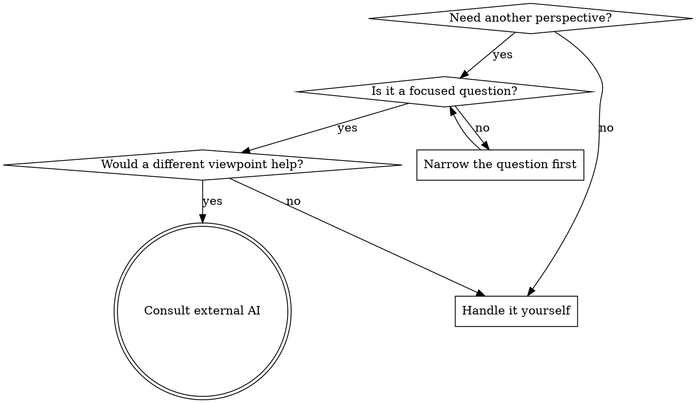

# Consulting Other AIs

Get focused perspectives from external AI providers (Codex CLI, Gemini CLI) during brainstorming, planning, or debugging. Unlike heavy orchestration, this is a lightweight consultation — you craft a focused question, point them at relevant files, and let them explore the codebase directly in read-only mode.

## Core Principle

**You control what gets sent.** Never dump the whole context. Craft a focused prompt with:
- The question or problem (1-3 paragraphs)
- File paths to examine (not file contents — they read files themselves)
- What perspective you want (critique, alternatives, risks, validation)

## When to Use



**Good times to consult:**
- During brainstorming step 4 (proposing approaches) — "what approaches are we missing?"
- After writing a design spec — "what holes do you see in this design?"
- During plan review — "is there a simpler way to structure this?"
- When stuck on a tradeoff — "given these constraints, which would you choose?"
- Debugging — "fresh eyes on this problem"

**Don't consult when:**
- The question is too broad ("review everything")
- You haven't formed your own opinion yet (consult after thinking, not instead of thinking)
- The task is simple and well-understood
- You'd need to send the entire session history for context

## How It Works

External AI CLIs (Codex, Gemini) run locally and have the same filesystem access as Claude. They can read files, search code, and explore the project — you don't need to paste file contents into the prompt.

**Codex CLI** runs in `read-only` sandbox mode for consultations:
```
codex exec --model <model> --sandbox read-only
```

**Gemini CLI** runs in `plan` approval mode (read-only):
```
gemini -p "" -o text --approval-mode plan -m <model>
```

Both receive the prompt via stdin (avoids shell argument length limits) and explore the codebase as needed.

## The Consultation Pattern

### 1. Frame the Question

Write a focused prompt. Include:
- **Context** (1-3 paragraphs): What you're working on and why
- **File pointers**: Paths to examine, not contents. Example: "Read `docs/superpowers/specs/2026-03-17-auth-design.md` for the full design."
- **Specific ask**: What perspective you want

### 2. Offer the Consultation to the User

Before invoking external providers, always present what you plan to send:

> I'd like to get external perspectives on this. Here's what I'd send to [Codex/Gemini/both]:
>
> **Question:** [the focused question]
> **Files they'd examine:** [list of paths]
> **Looking for:** [what kind of feedback]
>
> Want me to go ahead? [Codex only / Gemini only / Both / Skip]

Wait for user approval. They may want to adjust the question, add/remove files, or skip entirely.

### 3. Run the Consultation

Use the helper script from the project directory:

```bash
# Single provider
skills/consulting-other-ais/scripts/consult.sh codex "Your focused prompt here"
skills/consulting-other-ais/scripts/consult.sh gemini "Your focused prompt here"

# Both in parallel
skills/consulting-other-ais/scripts/consult.sh both "Your focused prompt here"
```

Or invoke directly via Bash tool if the script isn't available:

```bash
# Codex (read-only)
printf '%s' "$PROMPT" | codex exec --model gpt-5.4 --sandbox read-only

# Gemini (plan/read-only mode)
printf '%s' "$PROMPT" | env NODE_NO_WARNINGS=1 gemini -p "" -o text --approval-mode plan
```

### 4. Synthesize

Present results with clear attribution:

> **Codex perspective:** [summary of their response]
>
> **Gemini perspective:** [summary of their response]
>
> **My synthesis:** [where they agree, where they differ, what I'd recommend given all perspectives]

Don't just relay — synthesize. Highlight agreements, flag disagreements, and give your recommendation.

## Prompt Templates

### Design Review

```
I'm designing [feature] for [project]. The design spec is at:
  [path/to/spec.md]

Related implementation files:
  [path/to/relevant/code.py]
  [path/to/related/module.py]

Please read the spec and relevant code, then tell me:
1. What risks or edge cases does the design miss?
2. Are there simpler approaches to any component?
3. What would you change and why?

Be specific — reference sections of the spec and lines of code.
```

### Tradeoff Analysis

```
I'm choosing between these approaches for [problem]:

Option A: [brief description]
Option B: [brief description]
Option C: [brief description]

The constraints are: [list constraints]

The codebase context is in:
  [path/to/relevant/files]

Which option would you choose and why? What am I not considering?
```

### Plan Critique

```
I've written an implementation plan at:
  [path/to/plan.md]

It implements the spec at:
  [path/to/spec.md]

Please read both, then tell me:
1. Are any tasks unnecessarily complex?
2. Is the task ordering correct?
3. Are there dependencies I've missed?
4. Would you restructure anything?
```

### Fresh Eyes (Debugging)

```
I'm stuck on [brief problem description].

The relevant code is in:
  [path/to/file.py] (especially lines around [function/class])
  [path/to/test.py]

The symptom is: [what's happening]
What I've tried: [brief list]

Take a fresh look. What am I missing?
```

## Provider Strengths

Choose which provider to consult based on what you need:

| Need | Provider | Why |
|------|----------|-----|
| Code architecture critique | Codex | Strong on implementation patterns |
| Alternative approaches | Gemini | Broad knowledge, creative suggestions |
| Both perspectives | Both | When the tradeoff matters enough |
| Quick sanity check | Either | Pick whichever is available |

## Cost Awareness

External CLIs cost money via the user's API keys:
- **Codex**: ~$0.01-0.15 per consultation (varies by model and how much code it reads)
- **Gemini**: ~$0.01-0.03 per consultation

Always get user approval before invoking. For expensive consultations (large codebases, multiple rounds), note the potential cost.

## Integration with Other Skills

This skill is a **tool**, not a phase gate. It integrates as an optional step within existing workflows:

- **brainstorming** step 4: After proposing approaches, offer to consult for alternatives
- **brainstorming** step 7: During spec review, offer external review alongside subagent review
- **writing-plans** review loop: Offer external critique alongside plan-document-reviewer
- **systematic-debugging**: When stuck, offer fresh-eyes consultation

Never make consultation mandatory. Always offer, let the user decide.

## Checking Provider Availability

Before offering consultation, verify providers are available:

```bash
command -v codex >/dev/null 2>&1 && echo "codex: available" || echo "codex: not found"
command -v gemini >/dev/null 2>&1 && echo "gemini: available" || echo "gemini: not found"
```

Only offer providers that are installed. If neither is available, skip the consultation offer entirely.

## Common Mistakes

**Sending too much context:** Don't paste file contents. Give paths and let them read.

**Too broad a question:** "Review my project" gets shallow responses. "What edge cases does the auth token refresh in `src/auth/refresh.py` miss?" gets useful ones.

**Not synthesizing:** Relaying raw responses without analysis isn't helpful. Always add your perspective.

**Consulting before thinking:** Form your own opinion first. Consultation supplements your judgment, not replaces it.

**Skipping user approval:** Always present what you'll send and wait for approval. The user controls when their API keys get used.
