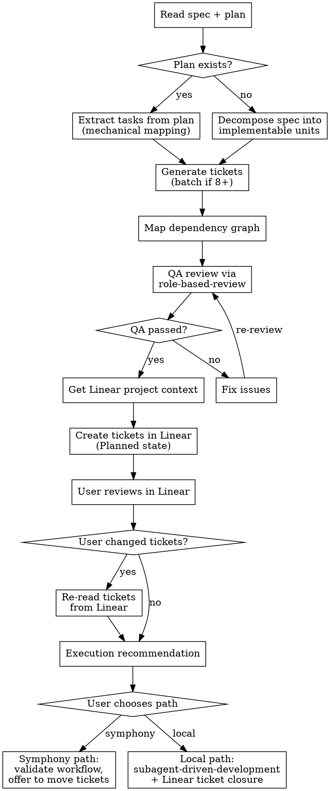

# Decompose to Tickets

Take an approved spec (and optional plan) and decompose it into Linear tickets with acceptance criteria, dependency mapping, and execution handoff.

**Announce at start:** "I'm using the decompose-to-tickets skill to break this down into Linear tickets."

**Called by:**
- `brainstorming` (skip-plan path) -- spec only, no plan
- `writing-plans` -- after plan approval, spec + plan

## Inputs

- **Spec file path** (required) -- the approved spec document
- **Plan file path** (optional) -- the implementation plan, if one was written

## Process Flow



## Step 1: Read and Analyze

Read the spec (and plan if present). Identify discrete work units. Each ticket should be:
- **Independently implementable** (given its dependencies are complete)
- **Scoped to 1-3 files** changed
- **Testable in isolation** -- an agent can verify its own work without the rest being done

## Step 2: Generate Tickets

Two modes depending on whether a plan exists:

**Plan exists -- mechanical extraction:**
The plan already has structured tasks with files, interfaces, and dependencies. Map them to tickets. Each plan task typically becomes one ticket. The plan did the hard decomposition work; this step is formatting and enrichment (adding verification commands, concrete acceptance criteria).

**No plan -- creative decomposition:**
Decompose the spec into implementable units. This requires judgment about:
- Where to draw file boundaries
- What order things need to be built
- What interfaces connect the pieces

**For 8+ tickets, generate in batches** (groups of 4-6) to avoid quality degradation in later tickets. Review each batch before starting the next.

Every ticket follows the structure in `ticket-template.md`. The critical requirement: **acceptance criteria must be autonomously verifiable**. An unattended agent must be able to confirm completion by running a command and checking the result.

## Step 3: Map Dependency Graph

Identify blocking relationships and parallel groups. Present visually:

```
Ticket 1: [title]
Ticket 2: [title]           [blocked by 1]
Ticket 3: [title]           [blocked by 1]
Ticket 4: [title]           [blocked by 2, 3]

Parallel groups: [1] -> [2, 3] -> [4]
```

This graph drives both Symphony dispatch order and local subagent sequencing.

## Step 4: Mandatory QA Review

<HARD-GATE>
QA review is mandatory. Do NOT skip it. Do NOT present it as a choice. Invoke it before proceeding.
</HARD-GATE>

Write the generated tickets to a temporary file (e.g., `docs/superpowers/tmp/tickets-<topic>.md`) so external providers can read them. Then invoke `role-based-review` with `roles: [qa]` on that file. QA verifies:

- Every acceptance criterion is autonomously verifiable (can an agent run a command and check?)
- No gaps between spec requirements and ticket coverage
- Dependencies are correct and complete
- Testing commands are concrete and executable

Fix any issues QA raises. Re-run QA review until it passes. If the loop exceeds 3 iterations, surface to the user for guidance.

## Step 5: Get Linear Project Context

Ask the user for:
- Linear team/project (if not already known from conversation context)
- Confirmation that ticket count and structure look right

Do not create tickets until the user confirms the structure.

## Step 6: Create Tickets in Linear

Create all tickets in **"Planned"** state with blocking relationships set.

**Tool priority:**
1. Linear MCP tools (if available)
2. The `linear` skill (if available -- check at runtime)
3. Fall back to `curl` with `$LINEAR_API_KEY`

Each ticket includes all sections from `ticket-template.md`: title, description (with spec/plan references), acceptance criteria, testing guidance, file scope, and blocked-by relationships.

## Step 7: User Reviews in Linear

Give the user the Linear project link and hand off review:

> "Tickets are in Planned with dependencies set up. Review and adjust them in Linear -- it's easier to visualize dependencies and edit there. When you're done, let me know:
> - If you changed anything significant, I'll re-read the tickets
> - Otherwise just say 'good to go'"

**If user reports changes:** Re-read tickets from Linear to pick up modifications.
**If good to go:** Proceed to execution recommendation.

## Step 8: Execution Recommendation

Based on ticket count and complexity, recommend an execution path. **User always decides.**

**5 or fewer tickets, simple dependencies:**
> "This is small enough to run locally with subagents. Want to do that, or send to Symphony?"

**6-12 tickets, or complex dependencies:**
> "I'd recommend Symphony for parallel execution here. Want to go that route, or keep it local?"

**13+ tickets:**
> "This is a big one -- Symphony with parallel dispatch would work well. Want to proceed that way?"

## Step 9a: Symphony Path

1. **Validate workflow configuration.** Verify or create `SYMPHONY-WORKFLOW.md` per `workflow-validation.md`. All 6 checks must pass.

2. **Offer to move tickets:**
   > "Move tickets from Planned to Todo when ready -- Symphony will pick them up. Want me to move them now, or will you do it from Linear?"

3. **Do NOT move tickets without explicit user confirmation.** Moving to Todo triggers Symphony dispatch.

## Step 9b: Local Path

1. **Hand off to `superpowers:subagent-driven-development`** with the plan/spec as the task source. Subagents read the plan and spec files directly -- they do NOT read Linear tickets.

2. **Close Linear tickets as tasks complete.** After each subagent task passes review and is committed, update the corresponding Linear ticket status to reflect completion.

3. **If Linear is unavailable** (API error, no key), log a warning and continue execution. Linear tracking is valuable but not blocking for local execution.

## Key Constraints

- **Tickets always created in "Planned" state, never "Todo."** Moving to Todo is a deliberate human action that triggers Symphony.
- **QA review is mandatory, not optional.** Every ticket set goes through QA before Linear creation.
- **Acceptance criteria must be autonomously verifiable.** If an agent cannot confirm completion by running a command, the criterion is not good enough.
- **Local execution reads plan/spec files, not Linear tickets.** Subagents work from the source documents.
- **Symphony execution reads tickets from Linear.** That is how Symphony discovers and dispatches work.
- **Both paths: tickets exist in Linear** for tracking, comments, and closure regardless of execution method.

## Integration

**Required skills:**
- **superpowers:role-based-review** -- QA review of ticket set (mandatory step 4)

**Execution skills (one chosen by user):**
- **superpowers:subagent-driven-development** -- local execution path
- Symphony workflow -- external orchestration path

**Reference documents:**
- `./ticket-template.md` -- ticket structure every generated ticket must follow
- `./workflow-validation.md` -- Symphony workflow verification checklist

**Called by:**
- **superpowers:brainstorming** -- skip-plan path (spec only)
- **superpowers:writing-plans** -- after plan approval (spec + plan)
