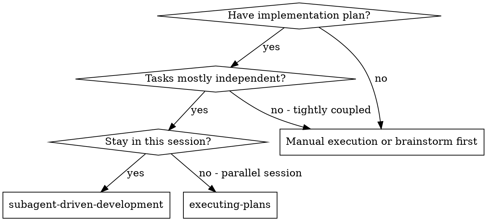
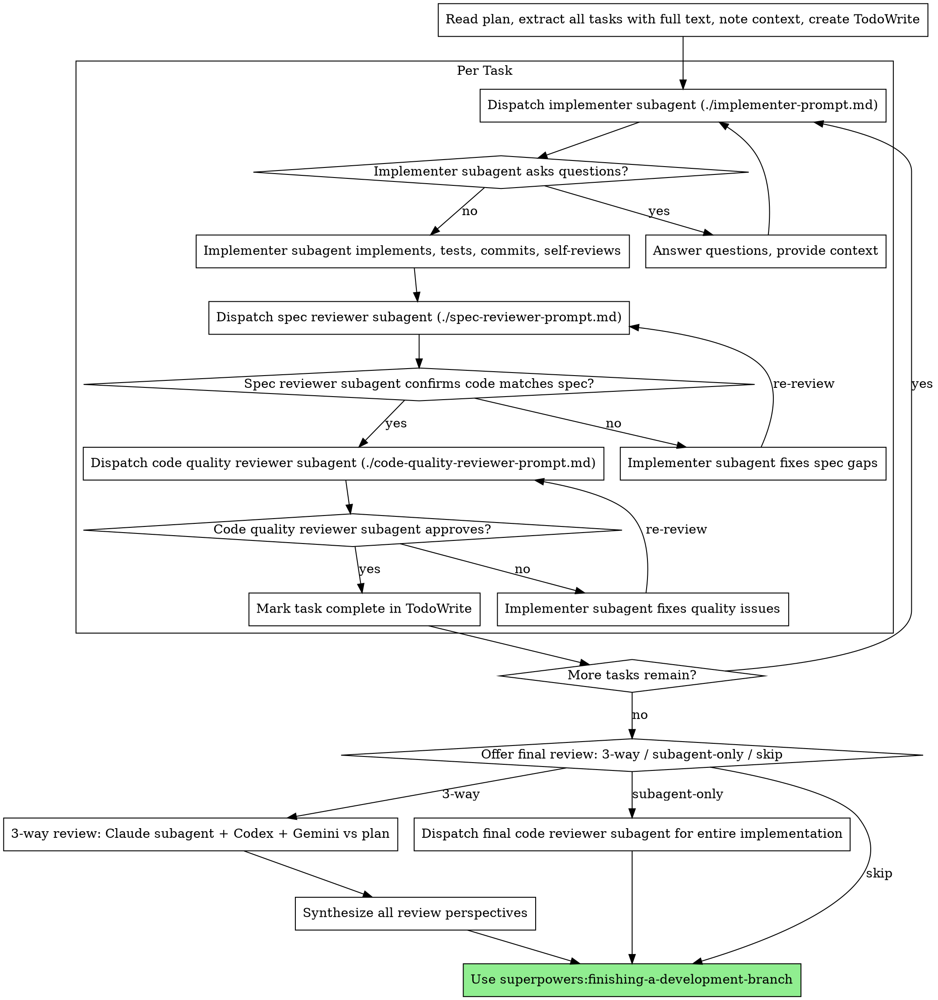

# Subagent-Driven Development

Execute plan by dispatching fresh subagent per task, with two-stage review after each: spec compliance review first, then code quality review.

**Why subagents:** You delegate tasks to specialized agents with isolated context. By precisely crafting their instructions and context, you ensure they stay focused and succeed at their task. They should never inherit your session's context or history — you construct exactly what they need. This also preserves your own context for coordination work.

**Core principle:** Fresh subagent per task + two-stage review (spec then quality) = high quality, fast iteration

## When to Use



**vs. Executing Plans (parallel session):**
- Same session (no context switch)
- Fresh subagent per task (no context pollution)
- Two-stage review after each task: spec compliance first, then code quality
- Faster iteration (no human-in-loop between tasks)

## The Process



## Model Selection

Use the least powerful model that can handle each role to conserve cost and increase speed.

**Mechanical implementation tasks** (isolated functions, clear specs, 1-2 files): use a fast, cheap model. Most implementation tasks are mechanical when the plan is well-specified.

**Integration and judgment tasks** (multi-file coordination, pattern matching, debugging): use a standard model.

**Architecture, design, and review tasks**: use the most capable available model.

**Task complexity signals:**
- Touches 1-2 files with a complete spec → cheap model
- Touches multiple files with integration concerns → standard model
- Requires design judgment or broad codebase understanding → most capable model

## Handling Implementer Status

Implementer subagents report one of four statuses. Handle each appropriately:

**DONE:** Proceed to spec compliance review.

**DONE_WITH_CONCERNS:** The implementer completed the work but flagged doubts. Read the concerns before proceeding. If the concerns are about correctness or scope, address them before review. If they're observations (e.g., "this file is getting large"), note them and proceed to review.

**NEEDS_CONTEXT:** The implementer needs information that wasn't provided. Provide the missing context and re-dispatch.

**BLOCKED:** The implementer cannot complete the task. Assess the blocker:
1. If it's a context problem, provide more context and re-dispatch with the same model
2. If the task requires more reasoning, re-dispatch with a more capable model
3. If the task is too large, break it into smaller pieces
4. If the plan itself is wrong, escalate to the human

**Never** ignore an escalation or force the same model to retry without changes. If the implementer said it's stuck, something needs to change.

## Linear Ticket Tracking

When this skill is invoked from the `decompose-to-tickets` local execution path, Linear tickets exist for each task. After each task is marked complete (both reviews passed):

1. Find the corresponding Linear ticket (match by task title or ticket identifier from the plan)
2. Move the ticket to "Done" state using Linear MCP tools, the `linear` skill, or `curl` with `$LINEAR_API_KEY`
3. Post a brief completion comment to the ticket referencing the commit or PR

This keeps Linear in sync without making it the source of truth for implementation. The plan/spec files remain the implementation source — Linear is the tracking layer.

**If Linear is unavailable** (API error, missing key, network issues), log a warning and continue execution. Ticket closure is tracking, not a gate — never block implementation progress on a Linear API failure.

**If invoked directly from a plan** (without decompose-to-tickets in the chain), skip this section entirely — there are no Linear tickets to close.

## Prompt Templates

- `./implementer-prompt.md` - Dispatch implementer subagent
- `./spec-reviewer-prompt.md` - Dispatch spec compliance reviewer subagent
- `./code-quality-reviewer-prompt.md` - Dispatch code quality reviewer subagent

## Example Workflow

```
You: I'm using Subagent-Driven Development to execute this plan.

[Read plan file once: docs/superpowers/plans/feature-plan.md]
[Extract all 5 tasks with full text and context]
[Create TodoWrite with all tasks]

Task 1: Hook installation script

[Get Task 1 text and context (already extracted)]
[Dispatch implementation subagent with full task text + context]

Implementer: "Before I begin - should the hook be installed at user or system level?"

You: "User level (~/.config/superpowers/hooks/)"

Implementer: "Got it. Implementing now..."
[Later] Implementer:
  - Implemented install-hook command
  - Added tests, 5/5 passing
  - Self-review: Found I missed --force flag, added it
  - Committed

[Dispatch spec compliance reviewer]
Spec reviewer: ✅ Spec compliant - all requirements met, nothing extra

[Get git SHAs, dispatch code quality reviewer]
Code reviewer: Strengths: Good test coverage, clean. Issues: None. Approved.

[Mark Task 1 complete]

Task 2: Recovery modes

[Get Task 2 text and context (already extracted)]
[Dispatch implementation subagent with full task text + context]

Implementer: [No questions, proceeds]
Implementer:
  - Added verify/repair modes
  - 8/8 tests passing
  - Self-review: All good
  - Committed

[Dispatch spec compliance reviewer]
Spec reviewer: ❌ Issues:
  - Missing: Progress reporting (spec says "report every 100 items")
  - Extra: Added --json flag (not requested)

[Implementer fixes issues]
Implementer: Removed --json flag, added progress reporting

[Spec reviewer reviews again]
Spec reviewer: ✅ Spec compliant now

[Dispatch code quality reviewer]
Code reviewer: Strengths: Solid. Issues (Important): Magic number (100)

[Implementer fixes]
Implementer: Extracted PROGRESS_INTERVAL constant

[Code reviewer reviews again]
Code reviewer: ✅ Approved

[Mark Task 2 complete]

...

[After all tasks]

You: All tasks complete. How would you like the final review?
  1. 3-way review — Claude subagent + Codex + Gemini review against plan
  2. Subagent only — Claude code reviewer
  3. Skip final review

User: 1

[Claude subagent dispatched with full implementation range]
[Codex + Gemini consulted in parallel with plan compliance prompt]

Claude subagent: Clean architecture, all tests pass, minor naming nit
Codex: All 5 plan tasks implemented. Task 3 spec says "retry 3 times" but code retries twice.
Gemini: Plan says "log to structured JSON" but logging uses plain text in task 4.

You: Two plan deviations found:
  - Task 3: retry count is 2, plan says 3 → fix
  - Task 4: plain text logging, plan says structured JSON → fix

[Fix both, re-run tests]
Done!
```

## Final Review: Plan Compliance

After all tasks are complete, offer a final review that checks the entire implementation against the original plan and spec. This catches cross-task issues and plan deviations that per-task reviews miss.

### Offer the Review

```
All tasks complete. How would you like the final review?

1. **3-way review** — Claude subagent reviews code quality while Codex + Gemini
   review implementation against the plan (recommended for non-trivial plans)
2. **Subagent only** — Claude code reviewer for the full implementation
3. **Skip** — Proceed directly to finishing the branch

Which option?
```

### Option 1: 3-Way Plan Compliance Review

Run in parallel:

**A. Claude subagent** — Standard final code review (existing behavior). Dispatch with `requesting-code-review/code-reviewer.md` template, using the BASE_SHA from before the first task and HEAD_SHA from after the last.

**B. External AIs vs plan** — Use `consulting-other-ais` to send Codex and Gemini a plan compliance prompt. The prompt should include:

- Path to the plan file
- Path to the spec file (if separate)
- The git diff range (base..HEAD) or instruct them to run `git diff <base>..<head>`
- A focused compliance question

**Plan compliance prompt template:**

```
Review this implementation against its plan and spec.

Plan: [path/to/plan.md]
Spec: [path/to/spec.md]
Implementation diff: run `git diff <BASE_SHA>..<HEAD_SHA>`

For each task in the plan, verify:
1. Was it implemented? (yes/no/partial)
2. Does it match the spec's requirements exactly?
3. Any deviations — intentional simplifications, missing edge cases, or scope creep?

Also check cross-cutting concerns:
- Are all plan tasks accounted for?
- Do the pieces integrate correctly?
- Any spec requirements that no task covers?

Be specific — reference plan task numbers, spec sections, and code file:line.
Output a task-by-task compliance table, then list any issues.
```

**Synthesize** — Present all three perspectives with clear attribution:

```
**Claude subagent (code quality):**
[summary — strengths, issues by severity, assessment]

**Codex (plan compliance):**
[task-by-task status, deviations found]

**Gemini (plan compliance):**
[task-by-task status, deviations found]

**Synthesis:**
- Agreed: [what all reviewers confirm is solid]
- Plan deviations: [list with task numbers]
- Code issues: [from Claude subagent]
- Recommendation: [fix list before proceeding, or ready to go]
```

If deviations are found, fix them before proceeding to `finishing-a-development-branch`. Re-run tests after fixes.

### Option 2: Subagent Only

Dispatch the standard final code-reviewer subagent (existing behavior). Use the full implementation range (BASE_SHA from before first task to current HEAD).

### Option 3: Skip

Proceed directly to `finishing-a-development-branch`.

## Advantages

**vs. Manual execution:**
- Subagents follow TDD naturally
- Fresh context per task (no confusion)
- Parallel-safe (subagents don't interfere)
- Subagent can ask questions (before AND during work)

**vs. Executing Plans:**
- Same session (no handoff)
- Continuous progress (no waiting)
- Review checkpoints automatic

**Efficiency gains:**
- No file reading overhead (controller provides full text)
- Controller curates exactly what context is needed
- Subagent gets complete information upfront
- Questions surfaced before work begins (not after)

**Quality gates:**
- Self-review catches issues before handoff
- Two-stage review: spec compliance, then code quality
- Review loops ensure fixes actually work
- Spec compliance prevents over/under-building
- Code quality ensures implementation is well-built

**Cost:**
- More subagent invocations (implementer + 2 reviewers per task)
- Controller does more prep work (extracting all tasks upfront)
- Review loops add iterations
- But catches issues early (cheaper than debugging later)

## Red Flags

**Never:**
- Start implementation on main/master branch without explicit user consent
- Skip reviews (spec compliance OR code quality)
- Proceed with unfixed issues
- Dispatch multiple implementation subagents in parallel (conflicts)
- Make subagent read plan file (provide full text instead)
- Skip scene-setting context (subagent needs to understand where task fits)
- Ignore subagent questions (answer before letting them proceed)
- Accept "close enough" on spec compliance (spec reviewer found issues = not done)
- Skip review loops (reviewer found issues = implementer fixes = review again)
- Let implementer self-review replace actual review (both are needed)
- **Start code quality review before spec compliance is ✅** (wrong order)
- Move to next task while either review has open issues

**If subagent asks questions:**
- Answer clearly and completely
- Provide additional context if needed
- Don't rush them into implementation

**If reviewer finds issues:**
- Implementer (same subagent) fixes them
- Reviewer reviews again
- Repeat until approved
- Don't skip the re-review

**If subagent fails task:**
- Dispatch fix subagent with specific instructions
- Don't try to fix manually (context pollution)

## Integration

**Required workflow skills:**
- **superpowers:using-git-worktrees** - REQUIRED: Set up isolated workspace before starting
- **superpowers:writing-plans** - Creates the plan this skill executes
- **superpowers:requesting-code-review** - Code review template for reviewer subagents
- **superpowers:finishing-a-development-branch** - Complete development after all tasks

**Optional:**
- **superpowers:consulting-other-ais** - External AI perspectives for 3-way final plan compliance review

**Subagents should use:**
- **superpowers:test-driven-development** - Subagents follow TDD for each task

**Alternative workflow:**
- **superpowers:executing-plans** - Use for parallel session instead of same-session execution
